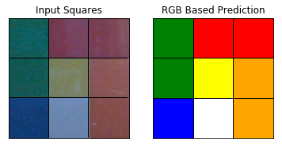
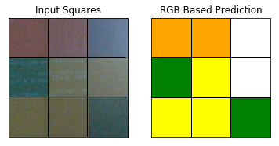

Over the past few weeks, I've been working on a developing a program
to assist the solution of a Rubik's cube. The project started as an
elaborate "joke," after I messed up a friend's Rubik's cube and
couldn't put it back into its solved state. The goal of this project
is to read in the state of an unsolved Rubik's cube from a camera feed
(or set of static images), and to provide step-by-step graphical
instructions on how to solve the Rubik's cube. Roughly, the project
breaks down into four steps:

  1. [Detect the squares on a Rubik's cube's face from a camera feed (or set of images).](#seeing)
  2. [Determine what colors are on each square of each face of the cube.](#classifier)
  3. [Solve the Rubik's cube.](#solve)
  4. [Display solution steps to the user.](#display)

In this page, I'll give a write-up of my current status on these four
steps. The project isn't yet complete, but I'm getting to a point
where I want to move onto other things. In particular, some of the
things that I will describe below haven't yet been committed to the
project's git [repository](https://github.com/pkepley/rubiks-solver).
However, the final result will likely end up being fairly similar.

## 1. Seeing the Cube 

Since I have literally no background in computer vision, getting my
computer to "see" the Rubik's cube was easily the hardest part of this
project - and it is something I still haven't fully solved. For
instance, my computer vision algorithm seems to go blind in dark
low-contrast, settings, or (sometimes) when I present it with only red
or blue squares. However, I've gotten my algorithm to a point where
it's successful at capturing the cube's faces a *decent* fraction of
the time. In the future, I may develop this a bit further... but at
this point, I'm kind of tired of messing with it. So, I'll most likely
add some tools that allow the user to provide assistance if (when) the
algorithm fails.

My cube detection algorithm was fairly heavily influenced by [this
write-up](https://stacks.stanford.edu/file/druid:yj296hj2790/Ng_Rubiks%20Cube_Reconstruction_from_Images.pdf). However,
the write-up (which is clearly a student's project) is somewhat vague,
and I was unable to get a working analogue of my own. To get
everything working, I had to modify their algorithm a bit. For
example, that author's algorithm could successfully extract up to 3
faces from a single image, whereas my algorithm can only extract a
single face at a time. In addition, my square detection algorithm
requires some additional processing that is not described in that
write-up.

To detect a cube, I proceed as follows:

  1. Obtain a full RGB image with a single cube face. 
  2. High-pass filter the image and convert the result to gray-scale. 
  3. Threshold the high-pass filtered image. 
  4. Apply a morphological closure to close up holes in the thresholded image.
  5. Clean the thresholded image by removing small clusters of noise pixels.
  6. Dilate the resulting image to thicken up the islands of black in the image.
  7. Split this image into contiguous regions (some of which will hopefully be squares!). 
  8. Retain only the regions with quadrilateral convex hulls. 
  9. Retain only the regions who's boundaries are approximately square. 
  10. Remove any squares that are too big or too small. 
  11. Assuming we've observed at least one square in both the top/bottom row and both the left/right column, use this information to fill in missing squares. 
  12. Extract the squares from the original RGB image. 

The steps of the procedure look something like this:

## 2. Classifying the Squares' Colors 

Once the squares have been identified on each of the cube's faces, we
then need to identify what the squares' colors are. For this purpose,
I decided to use a simple classification algorithm, based on some very
simple features extracted from each square. The features used in my
algorithm are just the average RGB pixel value over the square, and
pixel colors are classified using a support vector machine with a
polynomial kernel fit.

To train the SVM classifier, I collected 24 sets of images for each of
the 6 Rubik's cube faces under various lighting conditions. Of these
images, 17 were collected on my computer, and 7 were collected on my
phone. The square detection algorithm was used to extract all 9
squares from each face. To facilitate easy labeling, I solved the cube
prior to imaging it, and hence only needed to provide one color label
per image. Features were generated by averaging the pixel colors over
each image. In total, 1296 labeled training points were generated to
feed into the classification algorithm.

The training data is plotted <a href="#training-data">below</a>, and
demonstrates fairly robust class separation in the original feature
space. Again, each data point represents the average pixel value
collected over an extracted square. The data have been labeled
according to their class color (as opposed to the RGB pixel value
which they represent). Inspecting the graph, one can see that there is
some small overlap between classes. In particular, the blue and white
classes overlap a bit, which likely results from white squares
reflecting blue light emitted from my computer's monitor.

The following images demonstrate a successful classification
result. The image on the left shows the set of squares extracted from
[this input
image](../assets/posts/20190630_RubikMeans/SuccessClassOrigIMG.png),
and the image on the right shows the correctly predicted class
labels for each square.

Unsurprisingly, the color classification algorithm isn't perfect. It
can get tripped up due to new lighting conditions that it hasn't
previously observed, images with significant noise, or bad lighting
conditions. The following example shows a failed result based on [this
input
image](../assets/posts/20190630_RubikMeans/FailClassOrigIMG.png). The
squares in the first and second row of the right-most column are both
misidentified, most likely due to a combination of poor image quality
and poor lighting conditions. The top-most square should be labeled
blue (which is even a struggle for me to tell), but this square is
incorrectly identified as white. The middle square should be labeled
as yellow, however this square is misidentified as white. I'm not
terribly concerned about the first error (since this one is hard),
however it's a bit surprising to me that the middle square was
mislabeled, since the classification algorithm correctly identified
the other similar looking yellow squares in the image.

## 3. Solve the Cube

To solve the Rubik's Cube, I mostly followed [this
method](https://www.rubiks.com/how-to-solve-rubiks-cube). I stayed
pretty faithful to this procedure, although I did make a few minor
modifications. Overall, this isn't a very good solver, because it requires the
cube to be in a very specific state in order to proceed. However, it's
pretty easy to understand, and hence it was pretty easy for me to implement.

Since there's not much interesting to say here, I'm just going to show
a few images which demonstrate the solution algorithm's major
milestones. The interested reader can refer [here
](https://www.rubiks.com/how-to-solve-rubiks-cube) for details.

## 4. Display the results

As with the solver, there's not much to say about the graphics, so
I'll just end with a random solution example. This example is actually
a bit out of date, as it was generated before I had added in arrows to
guide the user.  One thing worth noting, is that the graphics
are created using Matplotlib. This sort of thing isn't *really* what
Matplotlib was designed to do, but I kind of enjoyed shoe-horning in
my use-case.

