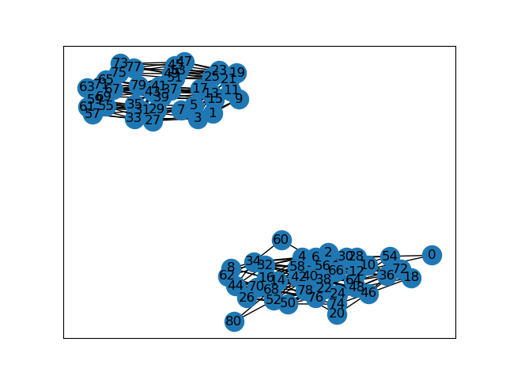

Two Friday's ago, the FiveThirtyEight [Riddler
problem](https://fivethirtyeight.com/features/can-you-track-the-delirious-ducks/)
asked us to consider some ducks stochastically swimming between rocks
in a pond. We are told that initially the ducks are sitting together
on a rock in the middle of the pond, and each minute all of the ducks
will independently randomly swim to one of their neighboring rocks
with equal probability. We are told to assume that the rocks are laid
out in a square grid, and that the ducks only swim horizontally and
vertically. Assuming $$2$$ ducks on a $$3 \times 3$$ grid, the prompt
asks us: how long on average will it take for all of the ducks to land
together on the same rock?

As usual, the bonus question is to generalize the problem. In
particular, we'll consider $$k \geq 2$$ ducks on an $$m \times m$$
grid (for $$m$$ odd). 

In this post I'll walk through my thought process for solving this problem 
and provide some solutions for small numbers of ducks and rocks.
I wrote some code to both solve this problem numerically and to
estimate the result by simulating the random process. This code can be found
[here](https://github.com/pkepley/blog-notebooks/tree/master/20200117_RiddlerSoln).

## Process Illustration
 
Before solving the problem I thought it would be fun to visualize
things. The following animation illustrates the process for $$k$$ ducks
(depicted by yellow circles) on an $$m \times m$$ grid of rocks. When
the ducks arrive on the same rock, they'll briefly turn green before
the process restarts in the middle.

<link rel="stylesheet" type="text/css" href="../assets/posts/20200127_RiddlerSoln20200117/duck_viz.css"/>  

	

## Solving for Average Duck Meeting Times

Because the only information that the ducks use to select their
next rock is which rocks are adjacent to their current rock, and since
the ducks each swim independently of one another, we can initially
consider each ducks' behavior independently as a discrete Markov
process on a graph with $$m \times m$$ vertices. The next step will be
to modify the process so that the joint process is absorbing when the
ducks are in the same state, and finally to solve a certain linear system to 
obtain the average time for the ducks to meet.

#### Single Duck Transitions
We start by considering a single duck on a $$m \times m$$
grid. Let's index the rocks (since we'll implement this numerically in
the end) and let $$i$$ denote the index of the rock that the duck is
currently standing on. Letting $$X_n$$ denote the single duck's random
walk, and $$N(i)$$ denote the set of neighboring cells, the single
duck transition matrix has the following form:

$$ 
P^{(1)}_{ij} = P(X_{n+1} = j | X_n = i) = 

\left\{\begin{array}{lr}
\frac{1}{|N(i)|} & \text{if $j \in N(i)$} \\
               0 & \text{else}
\end{array}\right.
$$

For ducks on a $$ 3 \times 3 $$ grid, if we index the rocks from left
to right and top to bottom as in the following table.

| 6 | 7 | 8 |
| 3 | 4 | 5 |
| 0 | 1 | 2 |

The resulting single-duck transition matrix has the following
appearance.

#### Multiple Duck Transitions
Since each duck transitions independently according to the same Markov
process, the $$k$$-duck transition matrix is simply the tensor product
of the $$k$$ single-duck transition matrices. That is,

$$ 
\begin{eqnarray}
P^{(k)}_{(i_1,\ldots,i_k), (j_1,\ldots,j_k)} &=& P(X^{(1)}_{n+1} = j_1, \ldots, X^{(k)}_{n+1} = j_k | X^{(1)}_n = i_1, \ldots, X^{(k)}_{n+1} = i_k) \\
&=& P^{(1)}_{i_1 j_1} \cdots P^{(1)}_{i_k j_k}
\end{eqnarray}
$$

If we flatten the $$k$$ indices as follows $$(i_1,\ldots,i_k) \mapsto
\sum_{j=1}^{k} (m^2)^{k-1} \cdot i_k$$ then the $$2$$-duck transition matrix
for a $$3 \times 3$$ grid has the following appearance:

#### Absorbing States
Next, we will modify the $$k$$-duck Markov process so that the
states where the ducks come together are absorbing. To do this, we
just set 

$$Q^{(k)}_{(i_1,\ldots,i_k),(j_1,\ldots,j_k)} =
  P^{(k)}_{(i_1,\ldots,i_k),(j_1,\ldots,j_k)}$$ 

if the $$i_l$$ are not all equal, otherwise

$$ Q^{(k)}_{(i,\ldots,i), (j_1,\ldots,j_k)} = 
\left\{
\begin{array}{lr}
1 & \text{if $j_1 =\ldots=j_k$} \\
0 & \text{else}
\end{array}\right.
$$

Put differently, to form $$Q^{(k)}$$ we take the $$k$$-duck transition
matrix $$P^{(k)}$$, and then we zero-out the rows where $$i_1 =\ldots
= i_k$$ while setting the on-diagonal entry in those rows to be $$1$$.

For $$2$$ ducks on a $$3 \times 3$$ grid, this results in the
following modified transition matrix.

#### Inaccessible States

Before proceeding to compute the mean absorption time, we will want to
make one additional simplification to the transition matrix
$$Q^{(k)}$$. Recall that our Markov process starts with all ducks
sitting on the same middle rock. The ducks then swim to a neighboring
rock according to $$P^{(k)}$$ and the process proceeds from there
according to $$Q^{(k)}$$. Because all of the ducks are
together at time $$n=0$$, and only move horizontally or vertically by
one cell, it is easy to see that the difference between the sum of each pair of
ducks' $$x$$ and $$y$$ coordinates is divisible by $$2$$. This will
remain true after every step in the Markov process. As a consequence,
some states of the transition matrix $$Q^{(k)}$$ are not reachable from our process.

The following image shows shows the graph described by the transition
matrix for $$2$$ ducks on a $$3 \times 3$$ grid.  In particular, we
see that index $$0$$ and $$1$$ belong to disjoint components of the
graph, so $$0$$ is not reachable from $$1$$ and vice-versa. Here $$0$$
corresponds to one of the absorbing states, and it can be shown that
all of the absorbing states are reachable from the initial position.

We do not need to worry about unreachable states, so they should be
removed from the matrix $$Q^{(k)}$$. In fact, for computational
efficiency we shouldn't even bother to compute the entries of the
matrix $$Q^{(k)}$$ for those states! Due to laziness, my
implementation currently does not use this simplification and instead
proceeds to compute $$Q^{(k)}$$ and to use the graph described above
to select the reachable states.

A reduced transition matrix $$\widetilde{Q}^{(k)}$$ for transitions to
the accessible states can obtained by excluding the inaccessible
states and re-indexing the matrix. For $$2$$ ducks on a $$3 \times 3$$
grid, the resulting reduced matrix looks as follows.

Notice that there are half as many rows in this matrix. For $$k \geq
2$$ ducks the reduction is in even greater (so I'm performing a lot
of wasted effort by not removing these states)!

### Mean Time to Absorption

Let $$ T_A $$ denote the time at which the process described by
$$\widetilde{Q}^{(k)}$$ is absorbed, and let $$\mu^{(k)}$$ be the
column vector of expected absorption times from transient states,
i.e. $$ \mu^{(k)}_i = E[T_A | X_1 = i] $$, where $$i$$ is a
transient state. A standard result from the theory of discrete-time
Markov processes is that if all states are either absorbing or
transient (which is the case for $$\widetilde{Q}^{(k)}$$), then
$$\mu^{(k)}$$ can be computed by solving a certain linear system.

To define the linear system, let $$R^{(k)}$$ to be the submatrix of
$$\widetilde{Q}^{(k)}$$ formed by including only the rows and columns
corresponding to transient states. Then $$\mu^{(k)}$$ can be computed
by solving

$$ (I - R^{(k)}) \mu^{(k)} = \mathbf{1} $$

where $$\mathbf{1}$$ is a column vector consisting entirely of ones.

The final step is to compute the expected absorption time $$E[T_A]$$
from the initial state at time $$ t = 1$$ and to add one to the result
to get the total expected steps. See that 

$$ E[T_A] = \sum_i E[T_A | X_1 = i] \cdot P^{(k)}(X_1 = i) = \sum_i \mu_i
\cdot P_{ii_0}$$

where $$i_0$$ is the state where all the ducks are in the middle
square. The final results is then 

$$ 1 + \sum_i \mu^{(k)}_i \cdot P^{(k)}_{ii_0}. $$

### Results

The following table shows the result of solving the above linear
system and simulating the Markov process for $$k = 2, \ldots, 5$$
ducks for grids with $$ m = 3,5,\ldots,9 $$ rocks per row. Results are
only shown when the matrix $$Q^{(k)}$$ had fewer than $$60,000$$ rows
(since my current implementation could only handle problems of that
size). The simulated mean was computed by averaging the stopping time
from $$10,000$$ simulated $$k$$-duck Markov processes.

|Rocks Per Row | Number of Ducks| Simulated Mean | Solved Mean|
|----|----|----:|----:|
|3|2|4.858|4.9054|
|3|3|18.208|18.4360|
|3|4|66.8171|66.7420|
|3|5|236.6482|237.3955|
|5|2|14.4637|14.6696|
|5|3|146.7471|149.7365|
|7|2|29.7964|29.7727|
|9|2|51.0354|50.0824|
